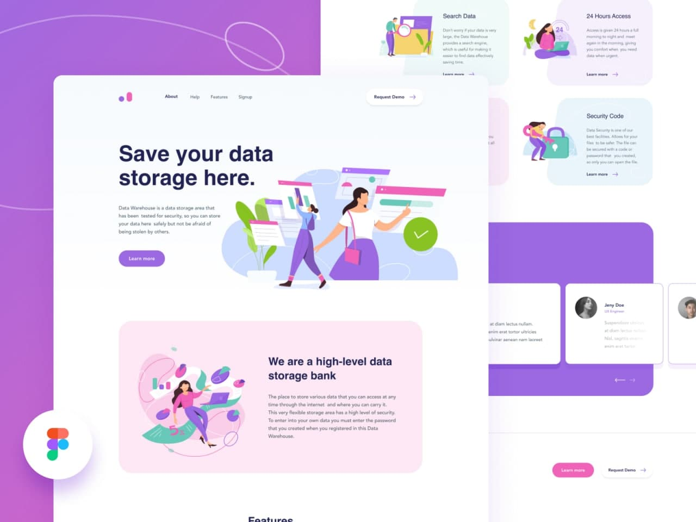

# 🚚 Project Title: Data Warehouse

## 🔗 Live Link / Demo Link:

https://alapina.github.io/Data-warehouse/

## 🛠 Technologies Used:

- HTML
- CSS Flexbox
- [Slick Slider](https://kenwheeler.github.io/slick/)

## 📚 About the Project:

[Design](https://www.uistore.design/items/data-warehouse-landing-page-for-figma/) from UI Store Design

This is my first independed project after learning basics of html / css and flexbox. On a time building this page I didn't know JS, so for slider I used Slick Slider plagin. Also, tryed to build this page cross-browser and Responsive. There is no mobile design, so I did it by myself. I'm not a great in design, so it's not looking much cool, but more important that all elements in a page are visible on mobile or tablet.

## 📷 Screenshots:

